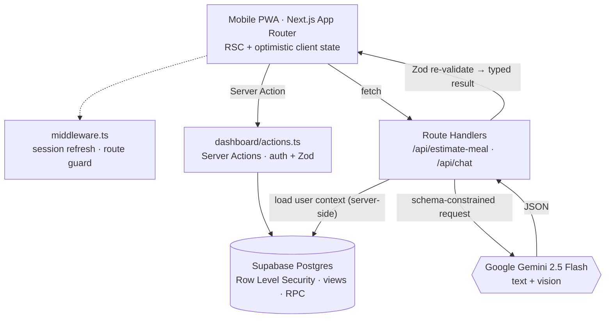

<div align="center">

# 🥗 LazyFit

**An AI-first weight-loss tracker for people who can't be bothered to count calories.**

Describe your meal in plain Thai — or just photograph it — and a vision LLM returns
calories, macros, and a meal category. One tap logs it. An in-app coach then answers
questions about *your* day, grounded in the data you've actually logged.


</div>

---

## Why it exists

Most diet apps fail because logging a meal is tedious — search a database, pick a
portion, adjust the grams. LazyFit's bet is that an LLM is *good enough* at
estimating a home-cooked Thai plate that the honest tradeoff — "roughly right,
instantly" beats "precise, but you'll quit in a week" — is worth making. The whole
app is built around removing friction:

- **No food database, no barcode scanner.** You type `กะเพราหมูกรอบไข่ดาว` or snap a photo.
- **80/20, not 100/0.** A weekly *cheat-meal quota* is a first-class feature, not a failure state.
- **Zero configuration to start.** Sensible defaults everywhere; onboarding computes a
  personal target with a live preview but every field has a fallback.
- **Mobile-first PWA**, Thai-language UI, per-user timezone (Bangkok by default).

---

## 🤖 The AI, in detail

Two distinct LLM surfaces, both talking to **Gemini 2.5 Flash over the raw REST API**
(no SDK dependency) from server-only code. The API key never reaches the client, and
every call is gated behind an authenticated Supabase session so it can't be used as
an open proxy.

### 1. Meal estimator — `POST /api/estimate-meal`

Turns free text and/or a photo into a **strictly-typed** nutrition estimate.

```jsonc
// request  (text, image, or both)
{ "text": "กะเพราหมูกรอบไข่ดาว พิเศษ" }
{ "imageBase64": "data:image/jpeg;base64,…", "imageMimeType": "image/jpeg" }

// response 200
{
  "food_name": "กะเพราหมูกรอบไข่ดาว",
  "calories": 720, "protein": 28, "carbs": 65, "fat": 38,
  "meal_type": "cheat",              // clean | normal | cheat  → drives the weekly quota
  "tip": "อร่อยได้ ครั้งหน้าลองเปลี่ยนหมูกรอบเป็นหมูสับ จะเบาลงเยอะ",
  "confidence": 0.7
}
```

**What makes it reliable:**

| Concern | How it's handled |
| --- | --- |
| Malformed model output | Gemini `responseSchema` (JSON-schema constrained decoding) **and** a second-pass Zod parse server-side — the client is guaranteed a valid `MealEstimate` shape or a typed error |
| `"350 kcal"` / `"12g"` string leakage | `coerceNumbers()` normalises stringy numerics before validation |
| Latency | `thinkingConfig.thinkingBudget: 0` (the task is simple), `temperature: 0.3`, 20 s `AbortSignal.timeout` |
| Vision + text in one call | Photo is sent as `inline_data`; multiple items in an image are folded into "one meal" by the system prompt |
| Leaking internals to users | `GeminiError` carries an HTTP status + a **safe `publicMessage`** ("used AI too often, take a break") separate from the logged detail |
| Portion / Thai-food nuance | System prompt encodes local serving sizes, the clean/normal/cheat rubric, and a non-judgemental, encouraging tone for `tip` |

### 2. Coach chat — `POST /api/chat`

A conversational assistant ("โค้ชลาซี่") that answers questions like *"เหลือกินได้อีกกี่แคล"*
or *"มื้อเย็นกินอะไรดีให้อยู่ในเป้า"*.

The interesting part is **grounding**: the client sends only the chat transcript. The
route handler loads the user's own data server-side — today's meals and workouts, the
7-day summary RPC, the last 30 weight points — and renders it into a compact
plain-text snapshot that's folded into the system prompt:

```
[ข้อมูลผู้ใช้ • วันนี้ 2026-09-01 • เขตเวลา Asia/Bangkok]
ชื่อเล่น: … · เป้าแคลอรีต่อวัน: 1,720 kcal · โควตามื้อ cheat: 1/3

— มื้ออาหารวันนี้: กินไปแล้ว 1,240 kcal (2 รายการ)
  • 08:15 ข้าวไข่เจียว — 430 kcal (P14/C48/F20)
  • 12:40 ส้มตำไก่ย่าง — 810 kcal (P52/C40/F44)
— สรุปวันนี้: สุทธิ = 1,090 kcal · ยังกินได้อีกประมาณ 630 kcal
…
```

Because the numbers come from the server, the model **can't be prompt-injected into
inventing them**, and the client can't inflate the context window. Other safeguards:

- Transcript is trimmed to the last 16 turns and re-sliced so it always starts and
  ends on a user turn (a Gemini API requirement).
- System prompt scopes the assistant to food / exercise / weight, defers medical
  questions to a doctor, and refuses to endorse sub-1,200 kcal or extreme fasting.
- Same typed-error + safe-message handling as the estimator.

### Shared AI plumbing — [`src/lib/gemini.ts`](src/lib/gemini.ts)

One ~270-line module: request builders for both surfaces, the response JSON schema,
number coercion, the `GeminiError` type, and a 20 s timeout wrapper. No SDK, no
streaming complexity — just `fetch` and Zod.

---

## Beyond the AI

<table>
<tr><td width="50%" valign="top">

**Row Level Security is the real auth layer**
Every table is owner-only via `auth.uid() = user_id`; the three log tables get
identical policies generated by a `DO $$` loop. Views use `security_invoker` and the
weekly RPC is `security invoker` so the caller's RLS still applies. Server Actions
re-check `auth.getUser()` on top. A `security definer` trigger with a pinned
`search_path` auto-provisions the profile row on signup.

</td><td width="50%" valign="top">

**Timezone-correct day math**
"Today" and "this week" are computed in each user's IANA timezone — in TypeScript
via `Intl.DateTimeFormat`, and in SQL via `... at time zone p.timezone` inside the
daily/weekly rollup views. Week start (Mon/Sun) is configurable.

</td></tr>
<tr><td valign="top">

**Wall-clock workout timer**
[`use-workout-timer.ts`](src/hooks/use-workout-timer.ts) persists a snapshot
(session start, banked seconds, running flag) to `localStorage` and recomputes
elapsed time from `Date.now()` on mount and on `visibilitychange` — so it survives a
reload or the phone screen turning off, instead of counting `setInterval` ticks.
Countdown auto-logs on completion.

</td><td valign="top">

**Optimistic UI with rollback**
The dashboard seeds state from an RSC, applies mutations locally (including the
derived weekly bar chart, via a pure `bumpDay` reducer), then reverts + toasts on
failure. Server Actions call `revalidatePath` to reconcile.

</td></tr>
<tr><td valign="top">

**Dependency-light by choice**
No chart library (hand-rolled SVG sparkline, bar strip, and timer ring), no Gemini
SDK, no state manager, no `next/font` network fetch (self-hosted variable Thai
font). ~12 runtime dependencies total.

</td><td valign="top">

**Details**
Pre-paint inline script prevents theme flash · accent themes swap only `--primary*`
HSL tokens · `prefers-reduced-motion` respected · safe-area insets · ARIA on the
custom notched bottom-nav, switches, and sheets · centralised, randomised,
non-judgemental microcopy (`say.*`).

</td></tr>
</table>

---

## Architecture



**Meal-logging lifecycle:** type/snap → `POST /api/estimate-meal` (auth → Zod →
Gemini w/ `responseSchema` → coerce → Zod) → render the card → **"บันทึกมื้อนี้"** →
`logMeal` Server Action (auth → Zod → insert under RLS → `revalidatePath`) →
optimistic append + weekly-total bump.

---

## Tech stack

| Layer | Choice |
| --- | --- |
| Framework | **Next.js 14** App Router — RSC, Server Actions, Route Handlers |
| Language | **TypeScript** (strict) |
| Data / Auth | **Supabase** — Postgres + RLS, email/password auth, `@supabase/ssr` cookie sessions |
| AI | **Google Gemini 2.5 Flash** via REST — structured output + vision |
| Validation | **Zod** everywhere a boundary is crossed (API bodies, Server Action inputs, LLM output) |
| UI | **Tailwind CSS**, **Framer Motion** (sheet transitions), **Lucide** icons, **Sonner** toasts |
| Platform | Installable **PWA** (manifest + iOS meta), deployed on **Vercel** |

---

## Project structure

```
src/
├─ app/
│  ├─ api/
│  │  ├─ estimate-meal/route.ts   # Gemini text/vision → validated MealEstimate
│  │  └─ chat/route.ts            # coach chat, grounded in the user's own data
│  ├─ dashboard/
│  │  ├─ page.tsx                 # RSC: parallel initial load
│  │  └─ actions.ts               # Server Actions: log meal / workout / weight, CRUD
│  ├─ settings/                   # profile, accent theme, activity toggles
│  ├─ login/page.tsx              # email + password
│  └─ layout.tsx · globals.css · manifest.ts
├─ components/
│  ├─ dashboard/                  # cards, onboarding sheet, workout timer, AI chat sheet
│  └─ ui/                         # Button · Card · Progress
├─ hooks/use-workout-timer.ts     # wall-clock timer, localStorage-persisted
├─ lib/
│  ├─ gemini.ts                   # REST wrapper, response schema, GeminiError
│  ├─ supabase/{client,server,middleware}.ts
│  ├─ nutrition.ts                # Mifflin-St Jeor BMR → TDEE → daily target
│  ├─ calories.ts                 # ACSM MET burn equation
│  ├─ activities.ts               # built-in exercises + MET / intensity presets
│  ├─ date.ts                     # timezone-aware day / week math
│  └─ themes.ts
└─ types/db.ts
supabase/
├─ migrations/                    # schema · RLS policies · triggers · views · get_week_summary RPC
└─ config.toml
```

---

## Running locally

**Prerequisites:** Node 18+, a [Supabase](https://supabase.com) project, and a free
[Google AI Studio](https://aistudio.google.com/apikey) API key.

```bash
git clone https://github.com/ZXzep/LazyFit.git && cd LazyFit
npm install
cp .env.example .env.local            # fill in Supabase URL + anon key, GEMINI_API_KEY

npx supabase link --project-ref <ref> # then apply the schema:
npm run db:push                       # migrations, RLS, triggers, views, RPC

npm run dev                           # http://localhost:3000
```

In the Supabase dashboard, enable the **Email** auth provider (password sign-in) and
add `http://localhost:3000` to the allowed redirect URLs.

<details>
<summary>Key environment variables</summary>

| Variable | Purpose |
| --- | --- |
| `NEXT_PUBLIC_SUPABASE_URL` / `NEXT_PUBLIC_SUPABASE_ANON_KEY` | Supabase client + server |
| `GEMINI_API_KEY` | Server-side only — never exposed to the browser |
| `GEMINI_MODEL` | Override the model (default `gemini-2.5-flash`) |
| `NEXT_PUBLIC_SITE_URL` | Base URL for auth redirects |

</details>

---

<div align="center">
<sub>Personal portfolio project · built with Next.js, Supabase, and Gemini.</sub>
</div>
